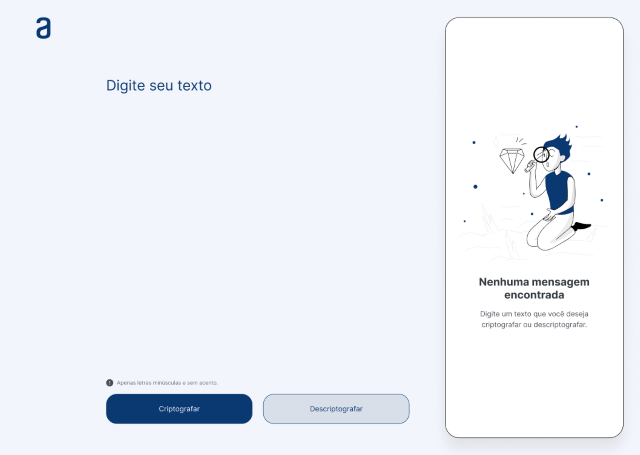
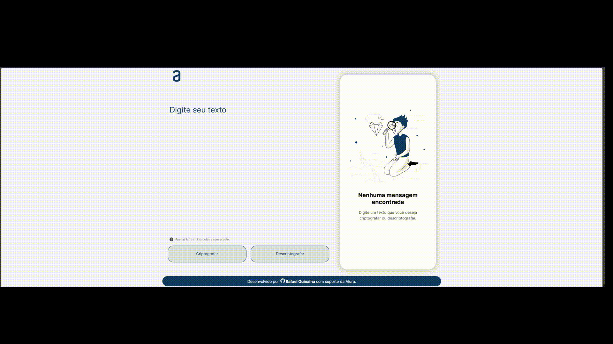

# <h1>Codificado e Decodificador de Textos Simples</h1>
<h2>Descrição do projeto</h2> 

 Esse é um desafio para colocar em prática os meus conhecimentos adquiridos na tilha de desenvolvimento ONE.

Foram aplicados conhecimentos básicos em HTML5, CSS3 e JavaScript.

## Funcionalidades

Digite um texto qualquer na área `Digite seu texto` usando letras minúsculas e sem acento, depois clique no botão `Criptografar` para ter o seu texto criptografado.

Use o botão `Copiar` para copiar o texto criptografado e cole na área onde você digitou o texto.

Agora é só clicar no botão `Descriptografar` para ver o texto descriptografado.

## Aplicativo em funcionamento

  

###

## Ferramentas Utilizadas

   

###

## Acesso ao projeto

Você pode [acessar o código fonte do projeto](https://github.com/xxxxx) ou [baixá-lo](https://github.com/xxxxx).

## Desenvolvedor

[ Rafael Quinalha](https://github.com/rquinalha)
